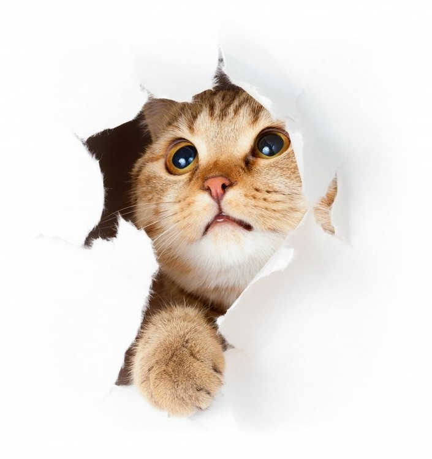

### Hexlet tests and linter status:

# Cat Chat

  

### Description

#### Cozy chat app, a simplified copy of famous Slack app. Chat with friends and create your own channels, but with a cute twist: adorable cats appear in the app to brighten your day. 🐾

### App deploy
https://frontend-project-12-1-rlho.onrender.com

### Tech Stack

  
  
  
  
  
  
  

